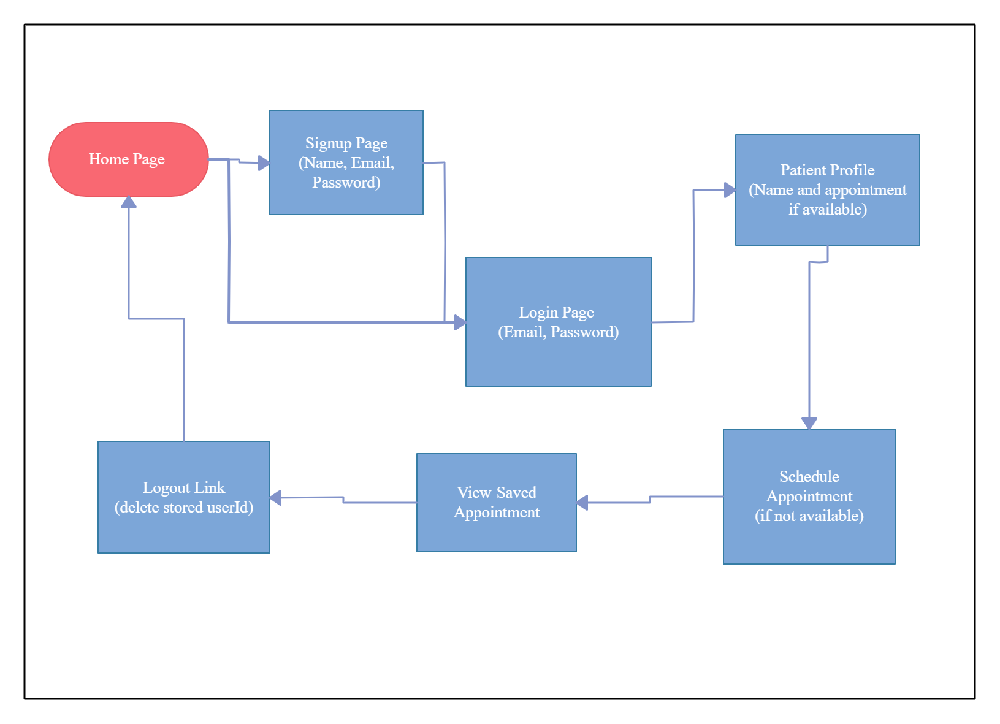

# appointment-scheduler-backend

## Overview

The goal of this app is to help Doctors and patients get in touch
by allowing patients to schedule an appointment with their personal
care providers via their website.

## Wireframe

## Front page

### user can click on new patient button that will take them to the new patient sign up sheet, or click on the login button that will take them to the login screen for already existing patients

## Patient sign up

### here the user can fill up the form with first name, last name, email and password of their choosing

## Patient login

### if the user has created an account, they can simply login with the email address and matching password

## Patient Profile without appointment

### if said patient has not made an appointment, the option to schedule an appointment will be available..

## Patient Profile with appointment

### if the patient has an existing appointment, it will show here
